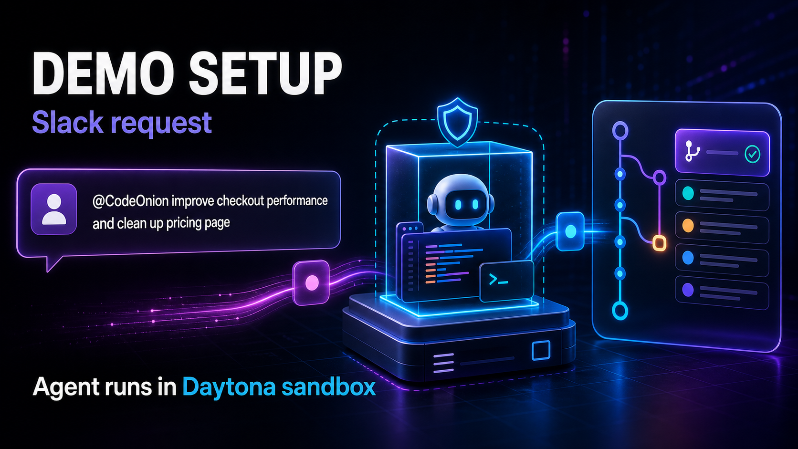

# Code Onion

Code Onion is **agent-ready ownership for repositories**.

It lets a coding agent propose any change, then decides whether the agent may merge, deploy, or access protected resources based on the deepest authority layer touched by the diff.



## Demo Company

The demo company is **Fast Tax**, a fictional tax-prep repo:

[github.com/yavol/fast-tax](https://github.com/yavol/fast-tax)

Fast Tax is where the coding agent makes product changes. Code Onion is the policy and approval layer watching those changes.

Fast Tax contains demo authority zones for:

- pricing and SKU mapping
- paid-customer entitlement checks
- external tax data provider selection
- recommendation ANN threshold tradeoffs
- low-risk implementation performance work
- protected integration tests

## Core Idea

Traditional `CODEOWNERS` says who reviews files.

Code Onion says which parts of the repo represent business authority.

```text
Agent opens PR in Fast Tax
  -> Code Onion inspects the diff
  -> OWNERS files map paths to authority layers
  -> semantic detectors catch pricing, provider, test, and threshold changes
  -> Slack-style approval UI collects stakeholder decisions
  -> 1Password releases the exact credential only after policy passes
```


## Demo Decisions

| Agent change | Code Onion decision |
| --- | --- |
| Improve document OCR performance | Auto-merge eligible after tests and benchmark |
| Lower recommendation ANN threshold | Run eval and metric gates before merge |
| Change product price | Requires `@finance` and `@product` |
| Switch tax API provider | Requires `@platform` and `@security` |
| Delete integration test | Blocked by default |

## 1Password Role

1Password is the credential gate, not the approval system.

Code Onion decides that a diff touched `money.pricing`, `vendor.api_provider`, `test_oracle.integration`, or another authority layer. Only after the required approvals, tests, and evals pass does Code Onion run the approved command through `op run`.

Example:

```bash
op run --env-file=config/1password.env.example -- \
  sh -c 'GITHUB_TOKEN="$CODE_ONION_PRICING_GITHUB_TOKEN" gh pr merge "$PR_NUMBER" --squash'
```

The model never sees the raw token. The credential is injected only into that one subprocess.

## Local Demo Setup

1Password setup is documented in [docs/1password-demo-setup.md](docs/1password-demo-setup.md).

Check the local credential references:

```bash
./scripts/check-1password.sh
```

For the hackathon, the enforcement brain runs locally on the laptop. In a production version, this becomes a required GitHub check or hosted Code Onion service backed by branch protection.
